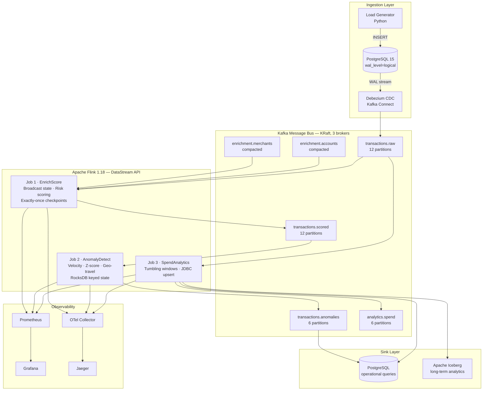
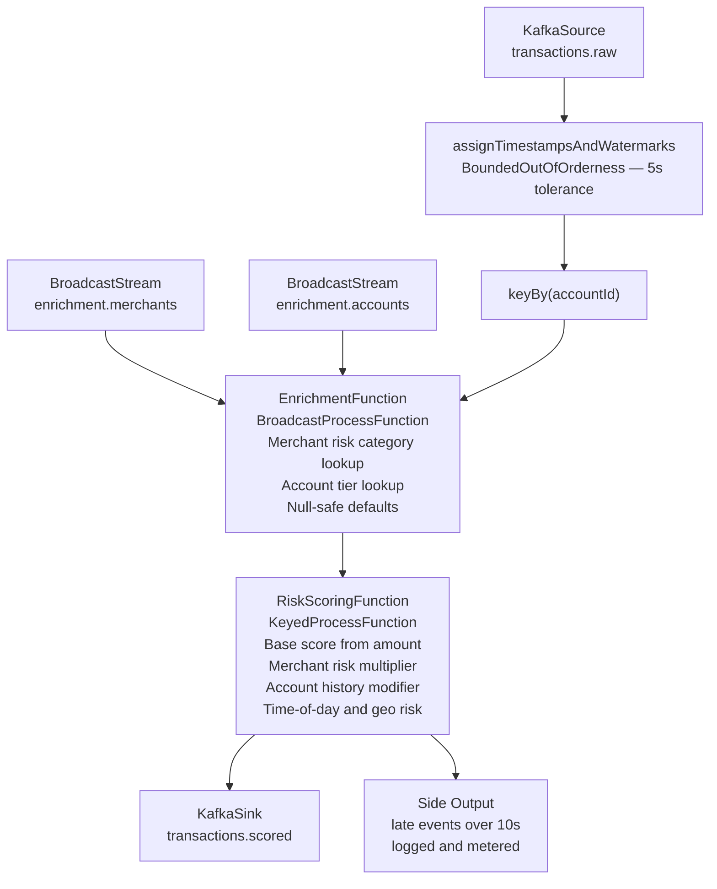
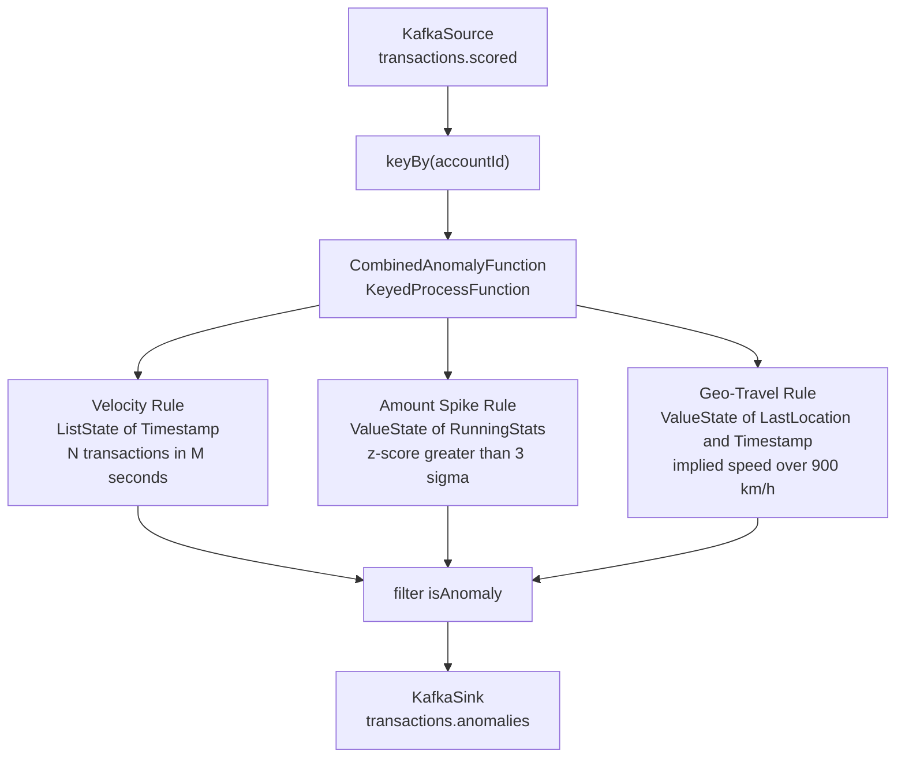
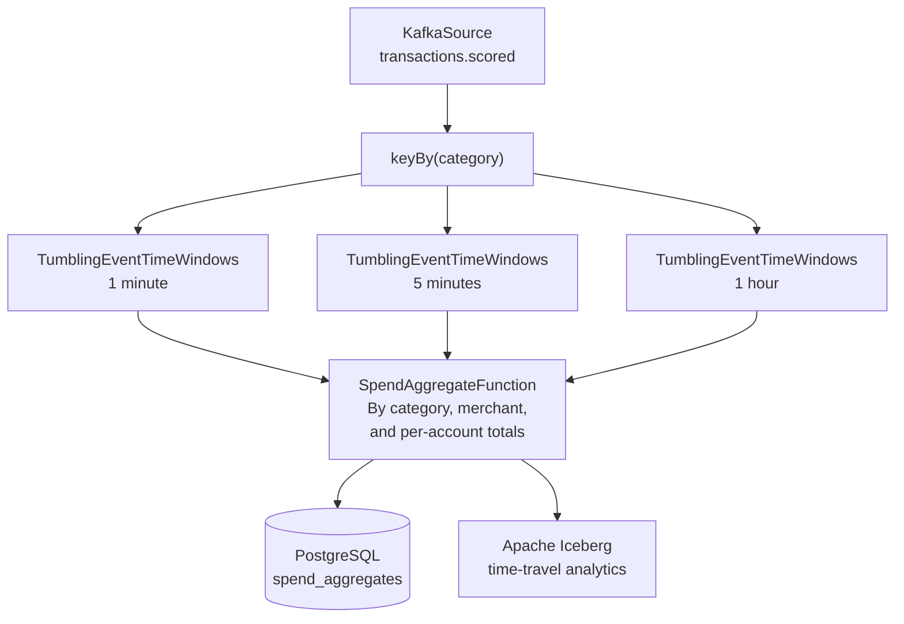
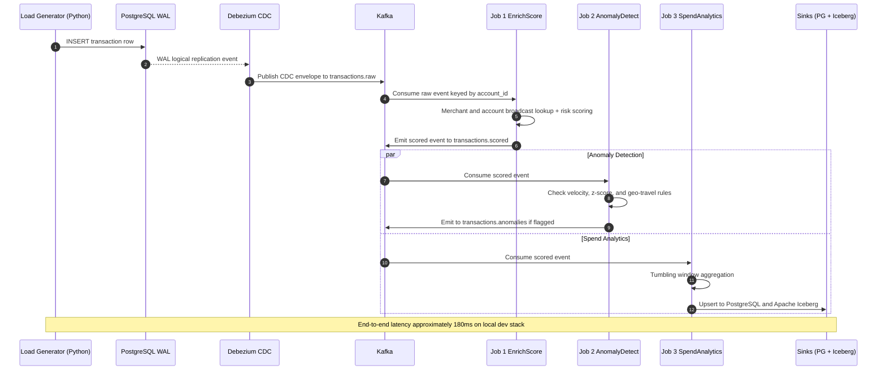
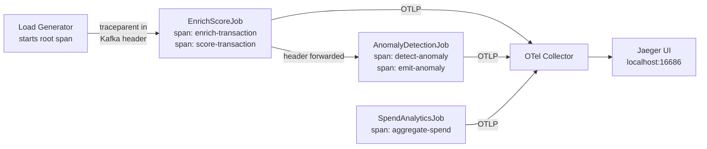

<div align="center">

# Real-Time Fraud Detection & Spend Analytics Pipeline

**Production-grade streaming pipeline processing 1M+ transactions/second with sub-second end-to-end latency**

[](https://flink.apache.org/)
[](https://kafka.apache.org/)
[](https://www.scala-lang.org/)
[](https://www.python.org/)
[](https://debezium.io/)
[](https://www.docker.com/)
[](LICENSE)

</div>

---

A production-grade streaming pipeline that ingests payment transactions via Change Data Capture (CDC), enriches and scores them in real time with **Apache Flink**, detects fraud patterns through windowed anomaly rules, and surfaces live results on **Grafana dashboards** — all with **~180ms end-to-end latency** at **1M+ events/sec**.

> **Tech-split decision:** JVM (Scala) owns the hot path for maximum throughput and type safety. Python owns load generation for rapid iteration without impacting the critical pipeline.

---

## Table of Contents

- [Features](#features)
- [Architecture](#architecture)
- [System Design](#system-design)
  - [Kafka Topic Design](#kafka-topic-design)
  - [Flink Job Architecture](#flink-job-architecture)
  - [CAP Theorem Trade-offs](#cap-theorem-trade-offs)
- [Data Flow](#data-flow)
  - [End-to-End Request Flow](#end-to-end-request-flow)
  - [Distributed Trace Propagation](#distributed-trace-propagation)
- [Getting Started](#getting-started)
  - [Prerequisites](#prerequisites)
  - [Installation](#installation)
  - [Running Locally](#running-locally)
- [Service URLs](#service-urls)
- [API Reference](#api-reference)
- [Deployment](#deployment)
- [Monitoring & Observability](#monitoring--observability)
- [Troubleshooting](#troubleshooting)
- [Development Guide](#development-guide)
- [Testing](#testing)
- [Contributing](#contributing)
- [License](#license)

---

## Features

| Capability | Detail |
|---|---|
| **Real-time CDC ingestion** | Zero-downtime source ingestion via Debezium 2.4 reading PostgreSQL WAL |
| **3 concurrent Flink jobs** | Enrichment & scoring, windowed anomaly detection, and spend analytics running in parallel |
| **Sub-second latency** | ~180ms from Postgres `INSERT` to anomaly event on the local dev stack |
| **Exactly-once semantics** | Two-phase commit checkpointing via Flink + Kafka integration |
| **Stateful fraud rules** | Per-account velocity counters, z-score amount spike detection, and geo-travel checks backed by RocksDB keyed state |
| **Full observability** | OpenTelemetry distributed tracing → Jaeger; Prometheus metrics → Grafana |
| **Schema evolution** | Avro + Schema Registry with backward-compatibility enforcement |
| **One-command demo** | `make demo` brings up the full stack, submits all jobs, and starts the load generator |

---

## Architecture



---

## System Design

### Kafka Topic Design

All transaction topics partition by `account_id` using consistent hashing. This guarantees:

- All events for a given account arrive at the **same Flink subtask** — no cross-partition joins for per-account state
- Keyed state (velocity counters, rolling averages) is **co-located** with incoming records
- Consumer lag is **monitorable per-partition** to detect hot-partition skew

| Topic | Partitions | Replication | Retention | Key | Notes |
|---|---|---|---|---|---|
| `transactions.raw` | 12 | 3 | 7 days | `account_id` | Debezium CDC envelope, Avro |
| `transactions.scored` | 12 | 3 | 7 days | `transaction_id` | Enriched + risk-scored |
| `transactions.anomalies` | 6 | 3 | 30 days | `account_id` | Reason code + evidence |
| `analytics.spend` | 6 | 3 | 14 days | `window\|dim\|value` | Aggregated spend records |
| `enrichment.merchants` | 3 | 3 | ∞ | `merchant_id` | Compacted, broadcast state |
| `enrichment.accounts` | 3 | 3 | ∞ | `account_id` | Compacted, broadcast state |

> **Schema evolution policy:** All schema changes must be backward-compatible (add optional fields with defaults). Breaking changes (field renames, type changes) require a blue-green job deployment with a shadow topic during cutover.

### Flink Job Architecture

#### Job 1 — EnrichScore



**State backend:** RocksDB &nbsp;|&nbsp; **Checkpoint interval:** 30s &nbsp;|&nbsp; **Delivery:** Exactly-once (two-phase commit)

#### Job 2 — AnomalyDetect



> All thresholds are config-driven in `application.conf` — **no recompile needed** for tuning. Update the config and restart the job.

#### Job 3 — SpendAnalytics



### CAP Theorem Trade-offs

| Concern | Mode | Reasoning |
|---|---|---|
| **Hot path — real-time scoring** | AP | Broadcast state may lag by seconds; fraud rules tolerate a slightly stale merchant risk factor |
| **Checkpointing / state** | CP | Two-phase commit with Kafka; throughput dips momentarily every 30s checkpoint interval |
| **Analytics sinks** | AP → CP | Iceberg ACID snapshots + Postgres `upsert-on-conflict` for idempotency |

> **Accepted trade-off:** A transaction scored during a broadcast-state lag uses the previous merchant risk category. The error window is bounded by the checkpoint interval (≤ 30s). Velocity and amount-spike signals are unaffected because they depend only on keyed state that is always current.

---

## Data Flow

### End-to-End Request Flow



### Distributed Trace Propagation

Every transaction carries a W3C `traceparent` header from Postgres `INSERT` through to the final output event:



---

## Getting Started

### Prerequisites

| Tool | Version | Notes |
|---|---|---|
| Docker Desktop | 24+ | [docker.com](https://www.docker.com) |
| Docker Compose | 2.20+ | Bundled with Docker Desktop |
| `make` | any | `brew install make` |
| sbt | 1.9+ | Optional — only needed to rebuild the Flink fat jar |
| Python | 3.11+ | Optional — only needed to run the load generator outside Docker |

### Installation

```bash
git clone <repo-url>
cd fraud-detection-pipeline
```

### Running Locally

**1. Start the full stack and register the Debezium connector:**

```bash
make up
```

**2. Build the Flink fat jar and submit all three jobs:**

```bash
make submit-jobs
```

**3. Open the dashboards:**

```bash
open http://localhost:3000    # Grafana  (admin / admin)
open http://localhost:8082    # Flink Web UI
open http://localhost:16686   # Jaeger traces
```

**4. Start the load generator** (separate terminal):

```bash
cd load-generator
pip install -r requirements.txt

# 200 tps, 5% fraud injection, run for 10 minutes
python src/generator.py --rate 200 --fraud-pct 5 --duration 600
```

**One-command end-to-end demo:**

```bash
make demo
# Runs: up → submit-jobs → load generator (500 tps, 5% fraud, 300s)
```

<details>
<summary>All available <code>make</code> targets</summary>

| Target | Description |
|---|---|
| `make up` | Build images, start full stack, register Debezium connector |
| `make down` | Stop all containers and remove volumes |
| `make build` | Compile Scala source and assemble Flink fat jar via sbt |
| `make submit-jobs` | Build jar, upload it, and submit all 3 jobs to Flink REST API |
| `make demo` | Full end-to-end: `up` + `submit-jobs` + load generator |
| `make logs` | Tail Docker Compose logs (last 50 lines, follow) |
| `make topic-list` | List all Kafka topics inside the container |
| `make connector-status` | Print Debezium connector JSON status |
| `make clean` | Tear down stack, clean sbt artifacts and Python cache |

</details>

---

## Service URLs

| Service | URL | Credentials |
|---|---|---|
| **Grafana** | http://localhost:3000 | `admin` / `admin` |
| **Flink Web UI** | http://localhost:8082 | — |
| **Prometheus** | http://localhost:9090 | — |
| **Jaeger UI** | http://localhost:16686 | — |
| **Kafka UI** | http://localhost:9080 | — |
| **Kafka Connect** | http://localhost:8083 | — |
| **Schema Registry** | http://localhost:8081 | — |

---

## API Reference

### Input — CDC Envelope on `transactions.raw`

```json
{
  "before": null,
  "after": {
    "transaction_id": "f47ac10b-58cc-4372-a567-0e02b2c3d479",
    "account_id":     "b2c3d4e5-0001-0001-0001-000000000004",
    "merchant_id":    "a1b2c3d4-0001-0001-0001-000000000004",
    "amount":         4250.00,
    "currency":       "USD",
    "latitude":       37.7749,
    "longitude":      -122.4194,
    "event_time":     "2026-06-12T14:30:00Z"
  },
  "op":    "c",
  "ts_ms": 1749737400000
}
```

| Field | Type | Description |
|---|---|---|
| `op` | string | CDC operation: `c` = create, `u` = update, `d` = delete |
| `ts_ms` | long | Debezium event timestamp (epoch milliseconds) |
| `before` | object \| null | Row state before change (`null` for inserts) |
| `after` | object | Row state after change |

### Output — Anomaly Event on `transactions.anomalies`

```json
{
  "transactionId": "f47ac10b-58cc-4372-a567-0e02b2c3d479",
  "accountId":     "b2c3d4e5-0001-0001-0001-000000000004",
  "reasonCode":    "AMOUNT_SPIKE",
  "evidence": {
    "amount":    "4250.00",
    "mean":      "47.32",
    "stddev":    "18.91",
    "z_score":   "217.85",
    "threshold": "3.0"
  },
  "detectedAtMs": 1749737400234
}
```

| `reasonCode` | Rule | Evidence Fields |
|---|---|---|
| `VELOCITY` | N transactions in M seconds per account | `count`, `window_ms`, `threshold` |
| `AMOUNT_SPIKE` | z-score > 3σ above account mean | `amount`, `mean`, `stddev`, `z_score`, `threshold` |
| `GEO_TRAVEL` | Implied speed > 900 km/h between two transactions | `speed_kmh`, `distance_km`, `elapsed_ms` |

> **End-to-end latency:** ~180ms from Postgres `INSERT` to anomaly event on the local dev stack.

---

## Deployment

### Component Versions

| Component | Version | Rationale |
|---|---|---|
| Apache Flink | 1.18.1 | Latest stable; Scala 2.12 binaries available |
| Scala | 2.12.17 | Flink 1.18 ships Scala 2.12 artifacts |
| Apache Kafka | 3.6.x | KRaft mode — no ZooKeeper, improved partition performance |
| Debezium | 2.4.x | Stable CDC; PostgreSQL 15+ logical replication support |
| PostgreSQL | 15 | Logical replication, `wal_level=logical` required |
| Apache Iceberg | 1.4.x | Flink connector available; time-travel support |
| Prometheus | 2.48.x | Flink JMX → Prometheus reporter |
| Grafana | 10.2.x | Provisioned dashboards as code |
| OpenTelemetry | 1.32.x | Java agent + Collector; Kafka header propagation |
| Jaeger | 1.52.x | OTLP receiver; distributed trace UI |
| Python | 3.11 | Load generator and tooling |

### Scaling to 1M+ Events/Second

The local dev stack is configured for comfortable throughput. Reaching 1M+ events/sec requires targeted changes — no code rewrites.

<details>
<summary>Kafka partition sizing</summary>

```
partitions_needed = ceil(target_tps / throughput_per_partition)

# At 1M events/s with avg payload 500 bytes:
#   throughput = 1M × 500B ≈ 500 MB/s
#   throughput per partition ≈ 25 MB/s (commodity hardware)
#   partitions = ceil(500 / 25) = 20 per topic
#   Add 2× headroom → 48 partitions for transactions.raw and transactions.scored
```

**Increase partitions without restarting jobs:**

```bash
# Kafka only allows increases, not decreases
kafka-topics.sh --bootstrap-server kafka:29092 \
  --alter --topic transactions.raw --partitions 48
```

Flink automatically rebalances across new partitions on the next consumer group rebalance.
</details>

<details>
<summary>Flink parallelism settings</summary>

```yaml
# flink-conf.yaml — no code change needed
parallelism.default: 16            # was 4
taskmanager.numberOfTaskSlots: 8   # was 4
```

Scale TaskManagers dynamically:

```bash
docker compose -f infra/docker-compose.yml up -d --scale taskmanager=10
# Result: 10 TaskManagers × 8 slots = 80 execution slots
```

**Parallelism rule:** always keep `operator_parallelism ≤ kafka_topic_partitions` to avoid idle subtasks.

| Config | Local Dev | Target at 1M tps |
|---|---|---|
| Kafka brokers | 1 | 3+ |
| Topic partitions | 12 | 48+ |
| Flink TaskManagers | 2 | 10+ |
| Slots per TaskManager | 4 | 8 |
</details>

<details>
<summary>RocksDB state backend tuning</summary>

The anomaly detection job is the most state-heavy. Each account maintains:
- `ListState[Long]` — velocity timestamps
- `ValueState[RunningStats]` — amount history for z-score
- `ValueState[(Double, Double, Long)]` — last geo location

```yaml
# flink-conf.yaml
state.backend.incremental: true
state.backend.rocksdb.block.cache-size: 256mb
state.backend.rocksdb.writebuffer.size: 64mb
state.backend.rocksdb.writebuffer.count: 3
state.backend.rocksdb.compaction.style: LEVEL
state.backend.rocksdb.use-bloom-filter: true
```

At 1M tps with 1M accounts in state, full checkpoints can reach 50–200 GB. Incremental checkpoints upload only the delta (typically < 1% per interval). **Target:** < 2 GB per checkpoint interval.
</details>

<details>
<summary>Checkpoint interval trade-offs</summary>

| Interval | Recovery Time | Steady-State Overhead |
|---|---|---|
| 5s | Low (~5s data loss) | High — barriers every 5s |
| **30s** | **Moderate** | **Low — default** |
| 5 min | High | Minimal |

**Production recommendation:** 30s interval, 60s timeout. If `lastCheckpointDuration > 10s`, reduce external write frequency or increase timeout. Never set `minPauseBetweenCheckpoints` below 5s.
</details>

<details>
<summary>Network buffer tuning (high throughput)</summary>

At high throughput, network buffer exhaustion causes backpressure cascades:

```yaml
# flink-conf.yaml
taskmanager.network.memory.fraction: 0.15       # was 0.1
taskmanager.network.memory.min: 256mb
taskmanager.network.memory.max: 2gb
taskmanager.network.numberOfBuffers: 4096        # was 2048
```
</details>

<details>
<summary>Kubernetes deployment (beyond Docker Compose)</summary>

```yaml
# Flink Kubernetes Operator — deployment excerpt
spec:
  job:
    parallelism: 48
  taskManager:
    resource:
      memory: "4096m"
      cpu: 4
    replicas: 12    # 12 × 4 slots = 48 execution slots
```

- Set `taskmanager.numberOfTaskSlots` to match available CPU cores per pod
- Use pod anti-affinity rules to spread TaskManagers across nodes and avoid hot-spot failures
</details>

---

## Monitoring & Observability

The pipeline ships three observability layers:

| Layer | Tool | What It Covers |
|---|---|---|
| **Metrics** | Prometheus + Grafana | Throughput, latency, consumer lag, fraud rate |
| **Tracing** | OpenTelemetry → Jaeger | End-to-end transaction trace across all jobs |
| **Logging** | Log4j2 → stdout | Per-event DEBUG logs, anomaly reason codes |

### Custom Metrics Reference

| Metric | Type | Description |
|---|---|---|
| `fraud_pipeline_events_processed_total` | Counter | Total events processed by a job |
| `fraud_pipeline_late_events_dropped_total` | Counter | Events dropped for arriving > 10s late |
| `fraud_pipeline_anomalies_detected_total` | Counter | Total anomaly events emitted |
| `fraud_pipeline_enrichment_misses_total` | Counter | Merchant or account broadcast state misses |
| `fraud_pipeline_velocity_flags_total` | Counter | Velocity rule triggers |
| `fraud_pipeline_amount_spike_flags_total` | Counter | Amount spike rule triggers |
| `fraud_pipeline_geo_travel_flags_total` | Counter | Geo-travel rule triggers |

### Key Flink Metrics to Watch

| Metric | Alert Threshold | Recommended Action |
|---|---|---|
| `flink_jobmanager_job_uptime` | Resets to 0 | Job restarted — investigate root cause |
| `flink_taskmanager_job_task_busyTimeMsPerSecond` | > 800 | TaskManager overloaded — scale out |
| `flink_jobmanager_job_lastCheckpointDuration` | > 10,000 ms | Reduce write frequency or increase checkpoint timeout |
| `flink_jobmanager_job_numberOfInProgressCheckpoints` | > 1 | Checkpoint stall — check backpressure indicators |

### Grafana Alert Queries

```promql
# Fraud rate over last 5 minutes
rate(fraud_pipeline_anomalies_detected_total[5m])

# Enrichment miss rate (indicates broadcast state lag)
rate(fraud_pipeline_enrichment_misses_total[1m])
  / rate(fraud_pipeline_events_processed_total[1m])

# Kafka consumer lag — EnrichScore job
kafka_consumergroup_lag{consumergroup="flink-enrich-score-cg"}

# All fraud pipeline consumer groups
kafka_consumergroup_lag{consumergroup=~"flink-.*-cg"}

# Checkpoint latency alert
flink_jobmanager_job_lastCheckpointDuration > 10000
```

### Finding a Transaction Trace in Jaeger

1. Open Jaeger UI at http://localhost:16686
2. **Service:** `fraud-pipeline` → **Operation:** `score-transaction`
3. Search by `transactionId` tag — paste any UUID from the `transactions` table
4. Click the trace → expand spans to see each stage with timing

| Span Name | Job | Key Attributes |
|---|---|---|
| `enrich-transaction` | EnrichScoreJob | `account_id`, `merchant_id`, `op` |
| `score-transaction` | RiskScoringFunction | `risk_score`, `merchant_risk` |
| `detect-anomaly` | AnomalyDetectionJob | `rule`, `account_id` |
| `emit-anomaly` | CombinedAnomalyFunction | `reason_code`, `evidence` |
| `aggregate-spend` | SpendAnalyticsJob | `dimension`, `window_start` |

---

## Troubleshooting

### Bottleneck Playbook

| Symptom | Metric to Check | Fix |
|---|---|---|
| Kafka consumer lag growing | `kafka_consumergroup_lag` | Increase Flink parallelism AND Kafka partition count together |
| TaskManager overloaded | `busyTimeMsPerSecond > 900` | `docker compose up -d --scale taskmanager=N` |
| Slow checkpoints | `lastCheckpointDuration > 10s` | Tune RocksDB write buffers; or switch sink to `AT_LEAST_ONCE` |
| JVM GC pauses > 200ms | GC logs | Set `taskmanager.memory.process.size: 4096m`; use `-XX:+UseG1GC` |
| Postgres sink is the bottleneck | Sink write throughput | Batch size ≥ 500, add PgBouncer, partition `spend_aggregates` by month |

### Common Scenarios

<details>
<summary>Consumer lag keeps growing</summary>

```bash
make topic-list          # Verify topics exist
make connector-status    # Verify Debezium connector is RUNNING
```

Then open the Flink Web UI (http://localhost:8082) and confirm the job is in `RUNNING` state. If the TaskManager busy ratio exceeds 900ms/s, add more TaskManagers:

```bash
docker compose -f infra/docker-compose.yml up -d --scale taskmanager=N
```
</details>

<details>
<summary>No anomalies appearing</summary>

1. Confirm fraud injection is active: `python src/generator.py --fraud-pct 5` (must be > 0)
2. Check `fraud_pipeline_velocity_flags_total` counter in Prometheus — if it is zero, no rules are triggering
3. Verify `transactions.scored` has messages: `make topic-list`
4. Lower the velocity threshold in `application.conf` under `anomaly.velocity.max-transactions`
</details>

<details>
<summary>Checkpoints failing</summary>

1. Check `flink_jobmanager_job_lastCheckpointDuration` — if consistently > 10s, increase checkpoint interval
2. Verify disk space on the checkpoint volume: `docker exec jobmanager df -h /flink-checkpoints`
3. Open the Flink job graph in the Web UI and inspect the **backpressure** indicator on each operator
</details>

---

## Development Guide

### Project Structure

```
fraud-detection-pipeline/
├── flink-jobs/                               # Scala — Flink DataStream API
│   ├── build.sbt
│   └── src/main/scala/com/fraudpipeline/
│       ├── enrichment/                       # EnrichScoreJob, EnrichmentFunction
│       ├── scoring/                          # RiskScoringFunction
│       ├── anomaly/                          # AnomalyDetectionJob, CombinedAnomalyFunction
│       ├── sinks/                            # SpendAnalyticsJob, Postgres/Iceberg sinks
│       └── utils/                            # Avro serialization, config, metrics
├── load-generator/                           # Python
│   ├── src/
│   │   ├── generator.py                      # Main entrypoint — CLI with --rate/--fraud-pct/--duration
│   │   ├── fraud_patterns.py                 # Fraudulent scenario injection
│   │   └── db.py                             # Postgres connection + INSERT logic
│   └── requirements.txt
├── infra/
│   ├── docker-compose.yml                    # Full stack definition
│   ├── kafka/
│   │   ├── create-topics.sh
│   │   └── connector-config.json             # Debezium connector registration payload
│   ├── postgres/
│   │   ├── init.sql                          # Schema + seed data
│   │   └── postgresql.conf                   # wal_level=logical
│   ├── flink/flink-conf.yaml
│   ├── prometheus/prometheus.yml
│   ├── otel/otel-collector.yaml
│   └── grafana/provisioning/
├── dashboards/                               # Grafana JSON — versioned alongside code
│   ├── realtime-traffic.json
│   ├── fraud-monitoring.json
│   └── spend-analytics.json
└── docs/
    ├── OBSERVABILITY.md
    └── SCALING.md
```

### Adding a New Anomaly Rule

1. Open `CombinedAnomalyFunction.scala`
2. Add new state descriptor(s) in `open()`
3. Implement `checkMyRule(txn, out)` — emit `AnomalyEvent` with a new `reasonCode`
4. Call it from `processElement()`
5. Add the threshold config in `application.conf` under `anomaly.my-rule`

> **No recompile needed for threshold changes** — update `application.conf` and restart the job.

### Adding a New Sink

1. Create a class in `flink-jobs/src/main/scala/com/fraudpipeline/sinks/`
2. Implement `SinkFunction[ScoredTransaction]` or use the built-in `JdbcSink`
3. Wire it into `SpendAnalyticsJob.main()` with `.addSink(...)`

### Scaling Configuration — Quick Reference

See [docs/SCALING.md](docs/SCALING.md) for the full bottleneck playbook. The only code changes needed are Kafka partition count and `parallelism.default` in `flink-conf.yaml`.

### Ordering Guarantees

Debezium captures WAL events in commit order. Each `(account_id, sequence_number)` tuple is monotonically increasing within a Kafka partition. Flink respects per-partition ordering. Cross-partition ordering is intentionally not guaranteed — no business rule requires global ordering across accounts.

---

## Testing

```bash
# Scala Flink jobs (requires sbt)
cd flink-jobs
sbt test

# Python load generator unit tests
cd load-generator
pip install -r requirements.txt pytest
pytest tests/ -v
```

---

## Contributing

1. Fork the repository and create a feature branch off `main`
2. Make your changes — run `sbt test` and `pytest tests/ -v` before pushing
3. Ensure Avro schema changes are backward-compatible (add optional fields with defaults only)
4. Open a pull request describing the motivation and approach

---

## Further Reading

- [ARCHITECTURE.md](ARCHITECTURE.md) — Data flow, topic design, CAP trade-offs, schema evolution
- [docs/OBSERVABILITY.md](docs/OBSERVABILITY.md) — Tracing a transaction, Prometheus metrics reference, Grafana dashboard guide
- [docs/SCALING.md](docs/SCALING.md) — How to reach 1M+ events/sec, bottleneck playbook, Kubernetes path

---

## License

MIT License — see [LICENSE](LICENSE) for details.
